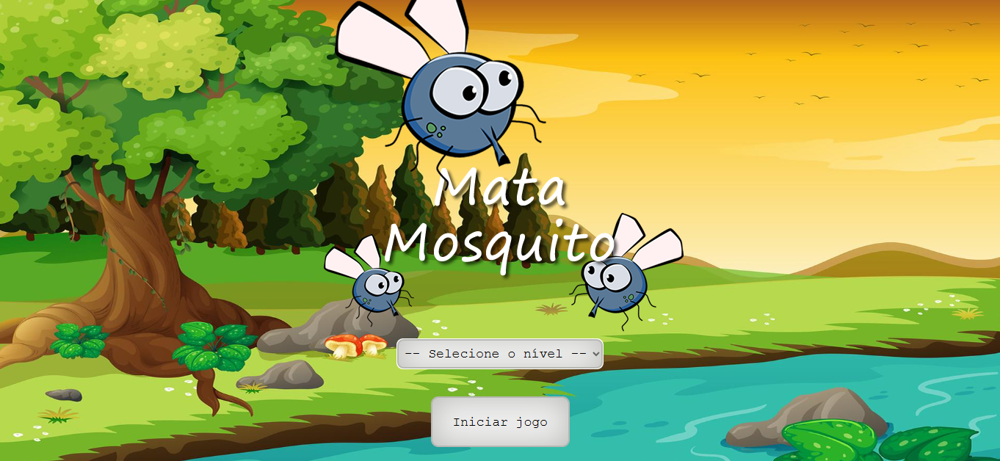
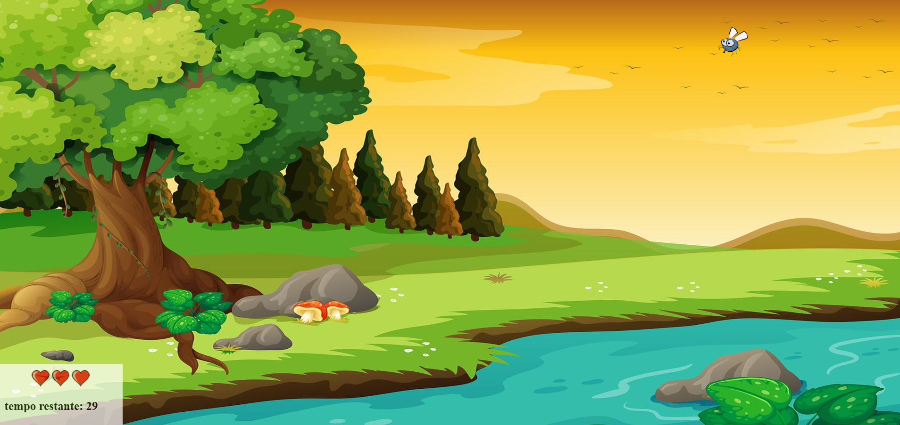
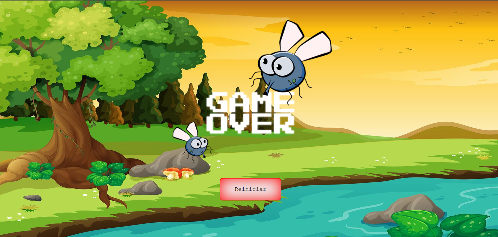

# 🦟 Jogo Mata Mosquito

Um jogo divertido e desafiador onde o objetivo é matar os mosquitos antes que o tempo acabe! Escolha entre três níveis de dificuldade e teste seus reflexos!

🎮 **[Clique aqui para jogar!](https://gamemosquito.netlify.app/)**

---
## 📸 

<div style="display: flex;">
  
  
    
</div>

## 🚀 Funcionalidades

- Três níveis de dificuldade: **Normal, Difícil e Impossível**
- Mosquitos aparecem em posições aleatórias na tela
- O jogador deve clicar nos mosquitos para eliminá-los
- Cada erro reduz as vidas do jogador (3 vidas no total)
- O jogo acaba quando o tempo termina ou as vidas se esgotam

## 🛠 Tecnologias Utilizadas

- **HTML** para estruturação das páginas
- **CSS** para estilização e responsividade
- **JavaScript** para a lógica do jogo

## 🎮 Como Jogar

1. Escolha um nível de dificuldade
2. Clique nos mosquitos que aparecem na tela antes que escapem
3. Se deixar passar muitos mosquitos, perderá vidas
4. O objetivo é sobreviver até o tempo acabar!

## 📌 Como Executar o Projeto

1. Faça o download ou clone este repositório:
   ```bash
   git clone https://github.com/seu-usuario/nome-do-repositorio.git
   ```
2. Abra o arquivo `index.html` em um navegador
3. Divirta-se matando mosquitos! 🦟

---

Divirta-se jogando e testando seus reflexos! 🎯🔥
